# Deep In Net

# Exercise 1

## Description

This exercise demonstrates basic Ethernet cabling concepts and IP communication between devices using RJ-45 cables in Packet Tracer.

## Knowledge Gained

### What is an RJ-45 cable?

An **RJ-45 (Registered Jack 45)** cable is the standard connector used for Ethernet networking.  
It contains **8 copper wires arranged in 4 twisted pairs**, which are used to transmit data between networking devices such as computers, switches, routers, and hubs.

---

### Difference between Straight-Through and Crossover RJ-45 Cables

#### -> Straight-Through Cable

A **straight-through cable** uses the **same wiring standard on both ends**.

It is typically used to connect **different types of devices**, such as:

- PC → Switch
- PC → Hub
- Router → Switch

#### -> Crossover Cable

A **crossover cable** swaps the transmit and receive pairs between the two connectors.

It is used to connect **similar devices directly**, such as:

- PC → PC
- Switch → Switch
- Router → Router

#### Image Explanation

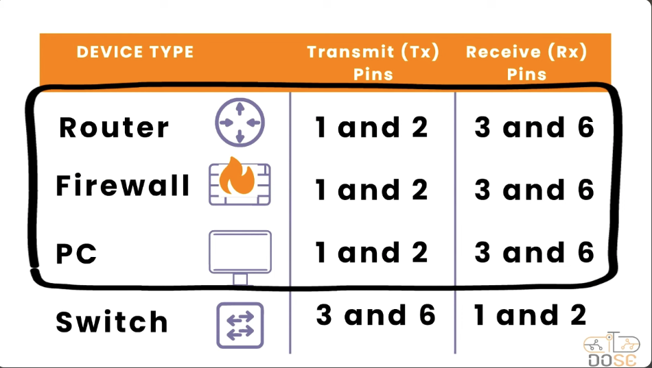

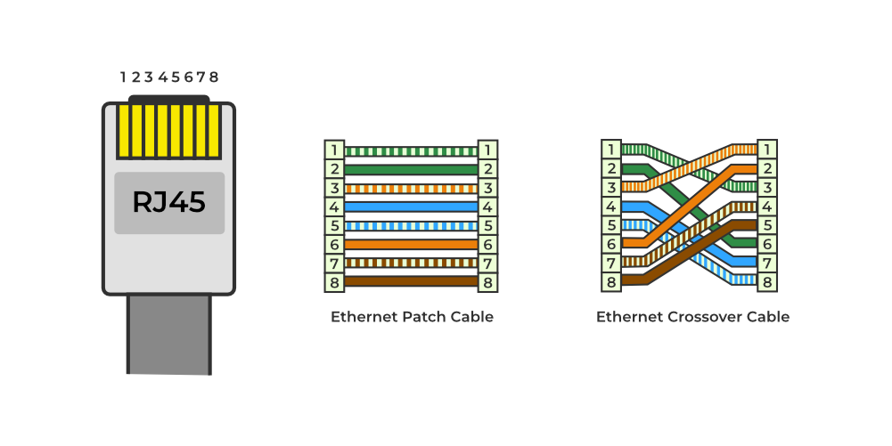

---

# Exercise 2

## Description

This exercise demonstrates how a **switch** and a **hub** operate in a network, how computers communicate when connected to each device, and how traffic behavior differs under simultaneous transmissions.

## Knowledge Gained

### Function of a Switch

A **network switch** is a device used to connect multiple devices within a Local Area Network (LAN).  
It forwards frames using **MAC addresses**, sending data only to the device that is supposed to receive it.

Characteristics:

- Operates at **OSI Layer 2 (Data Link Layer)**
- Maintains a **MAC address table**
- Creates **separate collision domains for each port**
- Supports **full-duplex communication**

#### Image Explanation

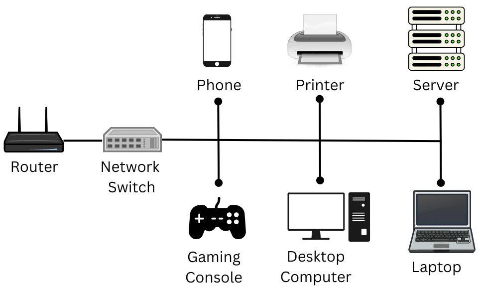

---

### Function of a Hub

A **hub** is a simple networking device that connects multiple Ethernet devices and operates as a **signal repeater**.

When a hub receives data, it **broadcasts the signal to every connected port**, regardless of the destination device.

Characteristics:

- Operates at **OSI Layer 1 (Physical Layer)**
- Does **not analyze MAC or IP addresses**
- All devices share **one collision domain**
- Uses **half-duplex communication**

---

### Difference Between Switch and Hub

| Feature          | Switch                             | Hub                       |
| ---------------- | ---------------------------------- | ------------------------- |
| OSI Layer        | Layer 2                            | Layer 1                   |
| Traffic Handling | Sends frames to the correct device | Broadcasts to all devices |
| Collision Domain | One per port                       | Shared by all devices     |
| Duplex Mode      | Full-duplex                        | Half-duplex               |
| Efficiency       | High                               | Low                       |

#### Image Explanation


---

# Exercise 3

## Description

This project demonstrates the design and configuration of a small local network using **Cisco Packet Tracer**, focusing on core network services: **DHCP, DNS, HTTPS, and FTP**.

## Knowledge Gained

### What is a Server?

A **server** is a computer or system that provides services, resources, or data to other computers (clients) on a network.

Examples include:

- Web servers
- File servers
- DNS servers
- DHCP servers

---

### DHCP (Dynamic Host Configuration Protocol)

**DHCP** automatically assigns IP addresses and network configuration parameters to devices in a network.

When a client joins the network, the DHCP process follows four steps:

1. Discover
2. Offer
3. Request
4. Acknowledge

This process is known as **DORA**.

#### Image Explanation

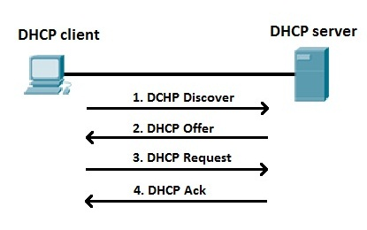

---

### DNS (Domain Name System)

**DNS** translates human-readable domain names into IP addresses.

Example:

```

deep-in-net.com → 192.168.1.99

```

This allows users to access services without remembering numeric IP addresses.

#### Image Explanation

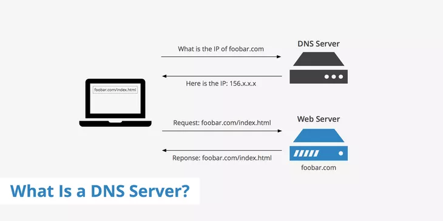

- **DNS** Server types:
  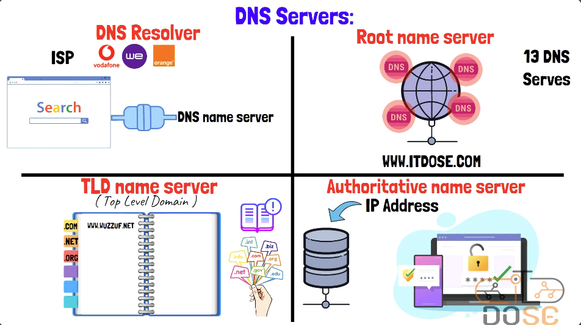

- Ho DNS works
  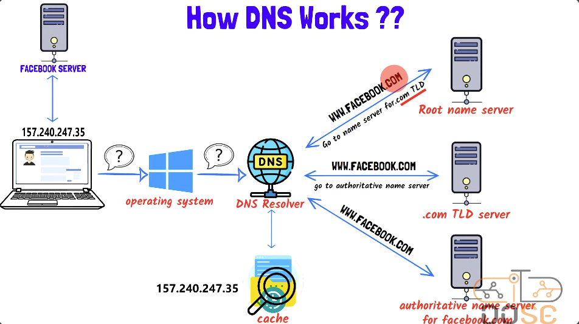

 <!-- https://www.keycdn.com/support/what-is-a-dns-server -->

### HTTP (HyperText Transfer Protocol)

**HTTP** is a protocol used for transferring web pages between clients and web servers.

Characteristics:

- Works over **TCP**
- Default port **80**
- Data is transmitted **in plaintext**

#### Image Explanation


---

### HTTPS (HyperText Transfer Protocol Secure)

**HTTPS** is the secure version of HTTP.  
It uses **TLS/SSL encryption** to protect communication between the client and the server.

Characteristics:

- Encrypts transmitted data
- Protects against interception and tampering
- Default port **443**

#### Image Explanation

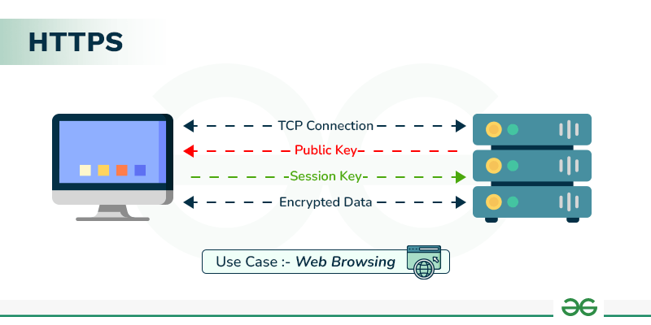

---

### FTP (File Transfer Protocol)

**FTP** is a protocol used for transferring files between computers on a network.

Features:

- Uses **TCP**
- Default ports **20 and 21**
- Supports authentication and permissions

#### Image Explanation

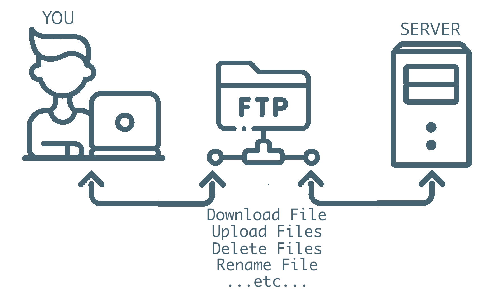

---

### TCP vs UDP

| Feature     | TCP                       | UDP             |
| ----------- | ------------------------- | --------------- |
| Connection  | Connection-oriented       | Connectionless  |
| Reliability | Reliable                  | Unreliable      |
| Speed       | Slower                    | Faster          |
| Use Cases   | Web, email, file transfer | Streaming, VoIP |

Both operate at the **Transport Layer (OSI Layer 4)**.

#### Image Explanation

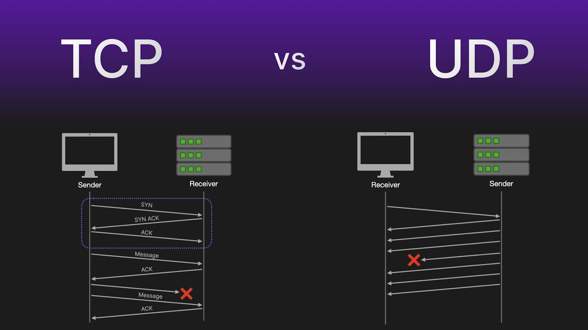

---

### Ports in Networking

A **port** is a logical communication endpoint used by applications to identify specific services on a device.

Examples:

| Protocol | Port    |
| -------- | ------- |
| HTTP     | 80      |
| HTTPS    | 443     |
| FTP      | 21      |
| DNS      | 53      |
| DHCP     | 67 / 68 |

Ports operate at the **Transport Layer (OSI Layer 4)**.

---

### DNS Record Types

Common DNS records include:

| Record Type | Purpose                          |
| ----------- | -------------------------------- |
| A           | Maps a domain to an IPv4 address |
| CNAME       | Alias for another domain         |
| MX          | Mail server record               |
| NS          | Authoritative name server        |

Example from the project:

```

deep-in-net.local → 192.168.1.99
deep-in-net.com → deep-in-net.local

```

---

# Exercise 4

## Description

This exercise demonstrates how a **router enables communication between two different IP networks**.

## Knowledge Gained

### What is a Router?

A **router** is a network device that connects **multiple networks** and forwards packets between them based on **IP addresses**.

It determines the best path for data using routing tables.

#### Image Explanation

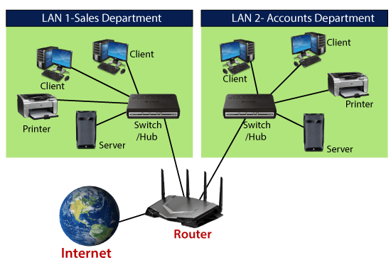

---

### Difference Between Switch and Router

| Feature      | Switch                 | Router                    |
| ------------ | ---------------------- | ------------------------- |
| Main Role    | Connect devices in LAN | Connect multiple networks |
| Address Used | MAC Address            | IP Address                |
| OSI Layer    | Layer 2                | Layer 3                   |

---

### OSI Layer of a Router

Routers operate at **Layer 3 – Network Layer** of the OSI model.

Their main tasks include:

- Routing packets between networks
- Determining the best path using routing tables
- Managing IP addressing between networks

#### Image Explanation

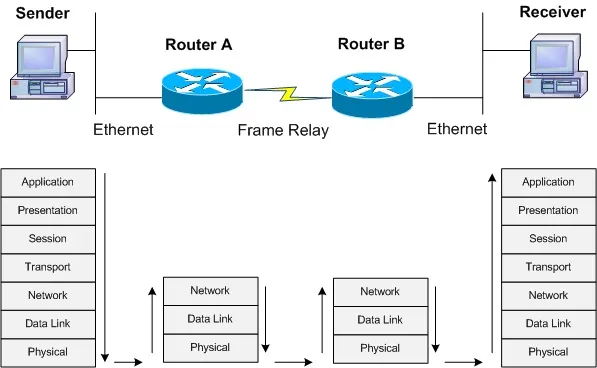

---

### Default Gateway

A **default gateway** is the router address used by a device to send traffic **outside its local network**.

When a device wants to communicate with another network, it forwards the packet to the default gateway.

Example:

```

PC IP: 192.168.1.10
Gateway: 192.168.1.1

```

---

# Exercise 5

## Description

This exercise demonstrates communication within local networks connected to switches and communication between different subnets through a router.

---

# Exercise 6

## Description

This exercise demonstrates communication between two separate local networks connected through two routers. Since each router only knows its directly connected networks by default, static routes are configured to enable end-to-end connectivity.

## Knowledge Gained

### Routing Table

A **routing table** is a data table stored in a router or host that lists the routes to particular network destinations.

Each entry contains:

- Destination network
- Subnet mask
- Next hop (gateway)
- Interface used to send packets

Routers consult this table to determine the **best path** for forwarding packets.

#### Image Explanation

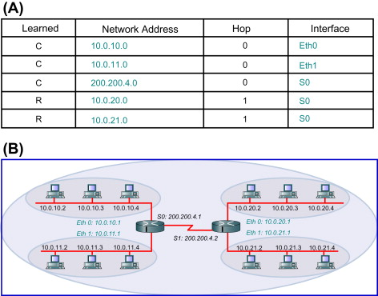

---

# Exercise 7

## Description

Create the network shown in **ex07-scenario** using Cisco Packet Tracer.

### Requirements

- All devices connected to the same switch must communicate with each other.
- All devices in **Subnet 1** must communicate with devices in **Subnet 2**.
- All devices in **Subnet 2** must communicate with devices in **Subnet 1**.

---

### Subnet 1 (Left Side)

- Network: `192.168.1.0/24`
- Switch1 connected to:
  - PC1
  - PC2
  - PC3
  - PC4
  - PC5

- Router1 connected to Switch1

### Subnet 2 (Right Side)

- Network: `192.168.2.0/24`
- Switch2 connected to:
  - Laptop0
  - PC6
  - PC7
  - PC8

- Router2 connected to Switch2

### Router-to-Router Link

- Network: `10.10.0.0/30`
- Used for inter-router communication

---

## IP Addressing Plan

### Subnet 1

| Device  | IP Address  | Subnet Mask   | Gateway     |
| ------- | ----------- | ------------- | ----------- |
| Router1 | 192.168.1.1 | 255.255.255.0 | —           |
| PC1     | 192.168.1.2 | 255.255.255.0 | 192.168.1.1 |
| PC2     | 192.168.1.3 | 255.255.255.0 | 192.168.1.1 |
| PC3     | 192.168.1.4 | 255.255.255.0 | 192.168.1.1 |
| PC4     | 192.168.1.5 | 255.255.255.0 | 192.168.1.1 |
| PC5     | 192.168.1.6 | 255.255.255.0 | 192.168.1.1 |

---

### Subnet 2

| Device  | IP Address  | Subnet Mask   | Gateway     |
| ------- | ----------- | ------------- | ----------- |
| Router2 | 192.168.2.1 | 255.255.255.0 | —           |
| Laptop0 | 192.168.2.2 | 255.255.255.0 | 192.168.2.1 |
| PC6     | 192.168.2.3 | 255.255.255.0 | 192.168.2.1 |
| PC7     | 192.168.2.4 | 255.255.255.0 | 192.168.2.1 |
| PC8     | 192.168.2.5 | 255.255.255.0 | 192.168.2.1 |

---

### Router Interconnection

| Device  | Interface | IP Address | Mask            |
| ------- | --------- | ---------- | --------------- |
| Router1 | Serial    | 10.10.0.1  | 255.255.255.252 |
| Router2 | Serial    | 10.10.0.2  | 255.255.255.252 |

---

## Router Configuration

### Router1

```bash
enable
configure terminal

interface Fa0/0
ip address 192.168.1.1 255.255.255.0
no shutdown

interface Se2/0
ip address 10.10.0.1 255.255.255.252
no shutdown

ip route 192.168.2.0 255.255.255.0 10.10.0.2
```

---

### Router2

```bash
enable
configure terminal

interface Fa0/0
ip address 192.168.2.1 255.255.255.0
no shutdown

interface Se2/0
ip address 10.10.0.2 255.255.255.252
no shutdown

ip route 192.168.1.0 255.255.255.0 10.10.0.1
```

---

### Check Routing Table

On routers:

```bash
show ip route
```

---

# Exercise 8

## Description

This exercise demonstrates communication between three different subnets connected through multiple routers. Each subnet contains devices connected to a switch, while routers provide routing between the networks. The exercise covers:

- Configuring router interfaces for LANs and serial links
- Adding static routes to enable inter-subnet communication
- Understanding first-ping delays due to ARP resolution

> Note: In Packet Tracer, the first ping to a device in a different subnet may fail due to ARP requests. Subsequent pings should succeed.

---

## Steps to Solve

---

## 1. Configure Router1

Enter CLI:

```bash
enable
configure terminal
```

### Configure LAN interface (Subnet1)

```bash
interface se0/0
ip address 192.168.1.193 255.255.255.192
no shutdown
exit
```

### Configure link to Router2

```bash
interface se0/1
ip address 10.10.0.1 255.255.255.252
no shutdown
exit
```

### Add static routes

```bash
ip route 192.168.2.0 255.255.255.0 10.10.0.2
ip route 192.168.3.160 255.255.255.240 10.10.0.2
```

---

## 2. Configure Router2

Enter CLI:

```bash
enable
configure terminal
```

### LAN interface (Subnet2)

```bash
interface se0/0
ip address 192.168.2.1 255.255.255.0
no shutdown
exit
```

### Link to Router1

```bash
interface se0/1
ip address 10.10.0.2 255.255.255.252
no shutdown
exit
```

### Link to Router3

```bash
interface se0/2
ip address 10.10.1.1 255.255.255.252
no shutdown
exit
```

### Add static routes

```bash
ip route 192.168.1.192 255.255.255.192 10.10.0.1
ip route 192.168.3.160 255.255.255.240 10.10.1.2
```

> **Note:** Router2 must point to the correct Subnet1 (`192.168.1.192/26`) to ensure replies from Subnet2/Subnet3 reach Subnet1 correctly.

---

## 3. Configure Router3

Enter CLI:

```bash
enable
configure terminal
```

### LAN interface (Subnet3)

```bash
interface se0/0
ip address 192.168.3.161 255.255.255.240
no shutdown
exit
```

### Link to Router2

```bash
interface se0/1
ip address 10.10.1.2 255.255.255.252
no shutdown
exit
```

### Add static routes

```bash
ip route 192.168.1.192 255.255.255.192 10.10.1.1
ip route 192.168.2.0 255.255.255.0 10.10.1.1
```

---

## 4. Configure PCs

- **Subnet1 PC example:**
  - IP: `192.168.1.198`
  - Subnet mask: `255.255.255.192`
  - Gateway: `192.168.1.193`

- **Subnet2 PC example:**
  - IP: `192.168.2.10`
  - Subnet mask: `255.255.255.0`
  - Gateway: `192.168.2.1`

- **Subnet3 PC example:**
  - IP: `192.168.3.165`
  - Subnet mask: `255.255.255.240`
  - Gateway: `192.168.3.161`

> **Important:** First ping from one subnet to another may fail due to ARP resolution. Subsequent pings should succeed.

---

## 5. Test Connectivity

From each PC:

```bash
ping <gateway>   # Test local connectivity
ping <other subnet PC>  # Test inter-subnet connectivity
```

- If the first ping fails but the second succeeds, this is normal (ARP learning).

# more infos:

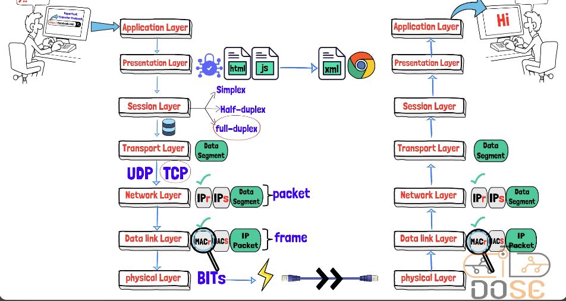
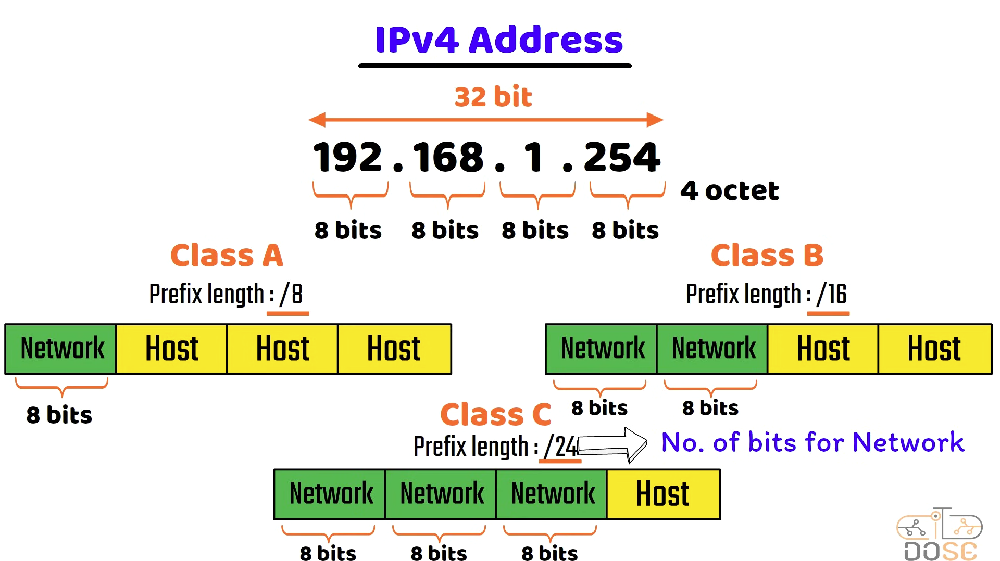
